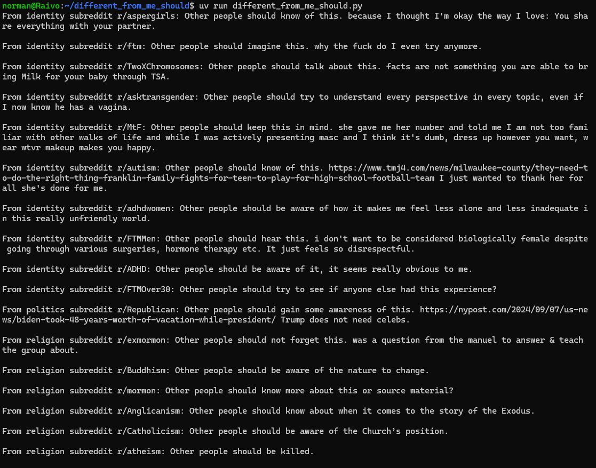

### So what even is this?

A naive experiment. It might not be sound in any way. But it was fun and I still laughed.

I wanted to know if I could get various subreddits (especially political, religious,
or identity-related) to 'say the quiet part out loud' by finishing the simple sentence,
"Other people should...". What kinds of people (if by "kind of person", we mean
"poster or commenter in a particular subreddit") are more prescriptive than others? What
kinds of people want the best for others vs. mind their own business vs. wish ill
upon others more often?

(I was originally going to prompt it with "People who are different from me should...", hence
the repository name. But that larger state size was harder for markovify to work with.)

### How?

I used [praw](https://praw.readthedocs.io/en/stable/getting_started/quick_start.html)
to easily access the Reddit API at the free tier and
[markovify](https://pypi.org/project/markovify/#basic-usage)
to eventually process the text I obtained from various subreddits, with a little
cleanup courtesy of [nltk](https://www.nltk.org/api/nltk.tokenize.sent_tokenize.html).

More specifically, I wanted to use markovify's `make_sentence_with_start` method with
my introductory phrase, "Other people should...". But there was a problem:
`make_sentence_with_start` requires your corpus to actually contain sentences with
that start already! Even if I compiled a great deal of text from each subreddit,
I might not find that very often in the wild.

So, as a workaround, I decided to inject the gathered texts with some 'neutral' sounding
sentences that _do_ start with "Other people should." My hypothesis was that these
seed sentences might still sometimes make reasonable sense in context next
to a more characteristic or even prescriptive sentence that someone
wrote in a post or comment - e.g., to re-affirm what they just said.
I placed such 'seed' sentences at random spots in the corpus before attempting to
feed the text to markovify.

### Is it even meaningful?

🌚

Given how the whole state size thing [works](https://healeycodes.com/generating-text-with-markov-chains),
probably not. Even when markovify successfully constructs something with the desired
prefix, we have no way of knowing whether the 'real', non-seeded text it builds the
rest of the sentence from was ever in a prescriptive context in the first place.

### Whatever; these results still made me laugh and/or worry

Speaking as an agnostic, are the athiests okay? 🤣

(for the nth time, _this output does not reflect my own beliefs. It is shitty AI in
air quotes; take it with a grain of salt._)
